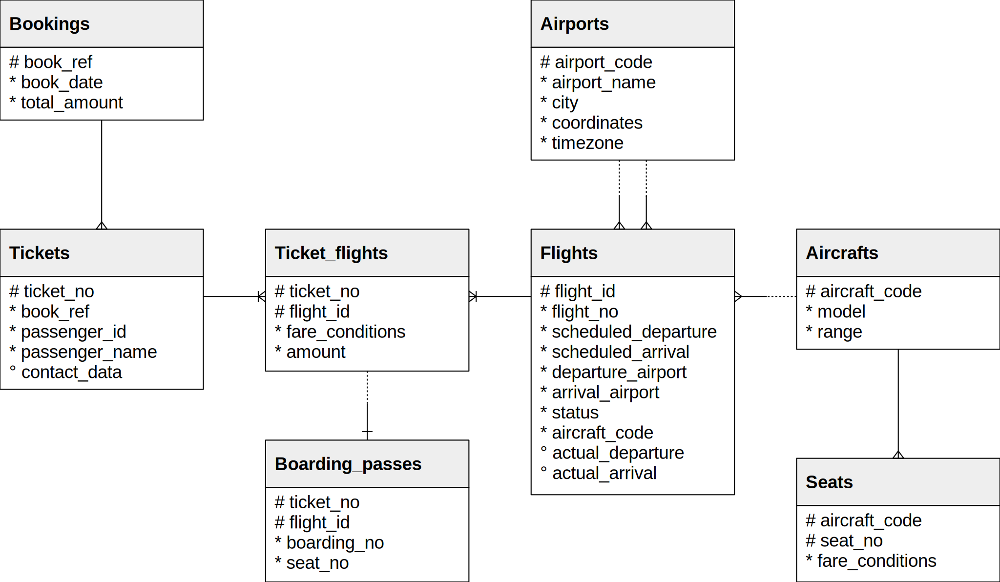
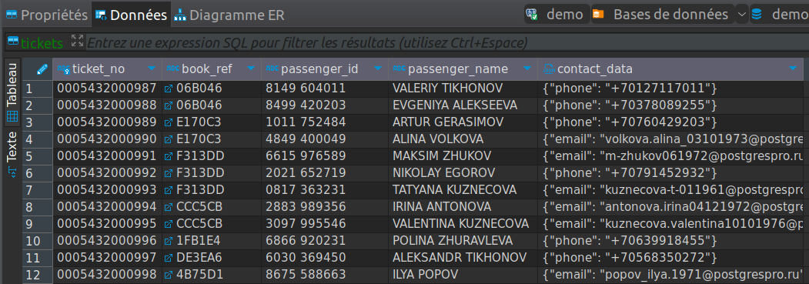
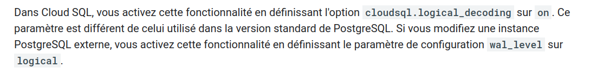
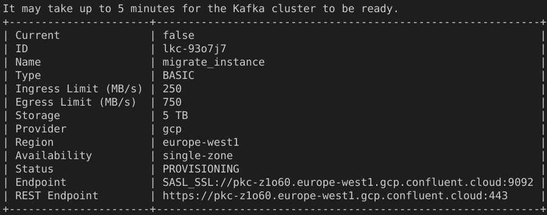
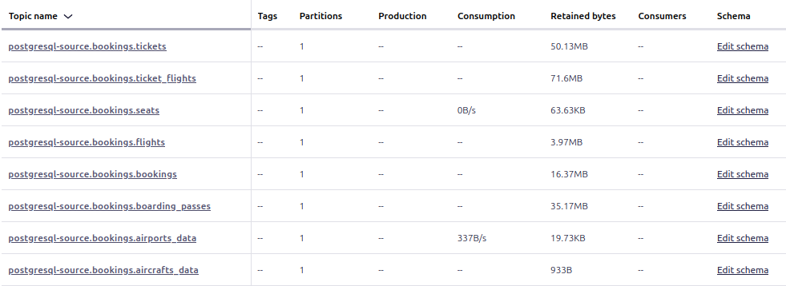
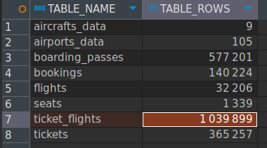

<h2 align="center">Migration d'une base PostgreSQL vers une base MySQL avec Apache Kafka</h2>

<div align="center"></div>

<h2 align="center">François Legland</h2>

## À propos du projet

### Description

Une compagnie aérienne utilise une base de données PostgreSQL en tant que base transactionnelle pour tous ses vols internationaux. Ainsi, toutes les données de chaque vol sont enregistrées dans plusieurs tables de la base de données, ce qui permet par la suite d'historiser l'ensemble des trajets passés tout en offrant la possibilité d'effectuer des analyses dessus.

Afin de faire évoluer son système transactionnel, la compagnie aérienne a décidé de migrer l'utilisation de la base PostgreSQL vers une base MySQL. Pour cela, elle souhaite donc utiliser cette nouvelle base de données en conservant les données déjà présentes dans la base PostgreSQL. Ainsi, en tant que Data Engineer, vous avez pour objectif d'effectuer cette migration entre les deux bases de données, tout en minimisant le temps d'interruption et en satisfaisant les contraintes mentionnées ci-dessous.

<div style="text-align:center;">
    
</div>

### Contraintes

Puisque la compagnie aérienne utilisait initialement PostgreSQL comme une base de données transactionnelle, il est donc très important de respecter certaines contraintes liées aux données:

* Il ne doit pas y avoir de perte de données entre les deux bases de données. Il ne doit pas non plus y avoir de données en doublons.

* La structure de la base de données MySQL doit être la plus proche possible de la base initiale PostgreSQL. En l'occurrence, l'intégralité du schéma et de ses contraintes (clés primaires, étrangères, séquences, etc) doivent être conservées lorsque cela est possible.  
 
* Pendant la migration de données, la base de données historique PostgreSQL ne reçoit aucune donnée afin de faciliter ce travail de migration. En revanche, pour des raisons liées à la disponibilité des services de l'entreprise, la migration ne doit pas durer plus de 15 minutes une fois déclenchée.

Le schéma de données de la base PostgreSQL est le suivant.

<div style="text-align:center;">
    
</div>

## Étapes de réalisation

Cette partie décrit les étapes entreprises pour réaliser le projet.

### 0. Clôner le dépôt git

```bash
git clone https://github.com/FrancLgd/PUBLIC-Migration-d-une-base-PostgreSQL-vers-une-base-MySQL-avec-Apache-Kafka.git
cd Migration-d-une-base-PostgreSQL-vers-une-base-MySQL-avec-Apache-Kafk
```

### 1. Créer et provisionner la base PostgreSQL source

Dans cette partie, nous nous chargons de créer et d'alimenter une base PostgreSQL source. Pour ce faire, nous utilisons le service Cloud SQL dédié de Google. Nous configurons manuellement cette instance dans l'interface Web. Cette instance est nommée **postgresql-source**. Ses caractéristiques peuvent être retrouvées à l'aide de la commande `gcloud sql instances describe postgresql-source`. À noter que nous ajoutons `0.0.0.0/0` comme réseau autorisé pour faciliter les futures connexions de Kafka à la base.

Une fois cette étape réalisé, nous allons premièrement transférer le fichier dump `./data/demo-small-en-20170815.sql` dans un bucket dédié. C'est à partir de ce fichier dump que sera créé la base source que nous souhaitons.

```bash
# Se connecter à notre environnement GCP
gcloud auth login

# Créer un bucket
gsutil mb -l europe-west1 gs://dump-file-bucket/

# Y transférer le fichier dump
gsutil cp ./data/demo-small-en-20170815.sql gs://dump-file-bucket/

# Accorder au compte de service Cloud SQL les droits sur le bucket
gsutil iam ch serviceAccount:p425695284074-4xswxt@gcp-sa-cloud-sql.iam.gserviceaccount.com:roles/storage.admin gs://dump-file-bucket
gsutil iam ch serviceAccount:p425695284074-4xswxt@gcp-sa-cloud-sql.iam.gserviceaccount.com:roles/storage.objectViewer gs://dump-file-bucket
```

Une fois ce transfert réalisé, nous pouvons créer la base souhaitée à partir du fichier dump comme suit.

```bash
# Créer la base vierge
gcloud sql databases create demo --instance=postgresql-source

# Y importer les données
gcloud sql import sql postgresql-source gs://dump-file-bucket/demo-small-en-20170815.sql --database=demo
```

Afin de s'assurer que la création s'est bien déroulée, nous affichons à l'aide d'un client comme DBeaver le contenu d'une des tables, ici `tickets`.

<div style="text-align:center;">
    
</div>

Enfin, pour des raisons de compatibilité avec notre futur connecteur (cf. sections suivantes), nous apportons la modification du paramètre suivant à la base :

<div style="text-align:center;">
    
</div>

Pour les mêmes raisons, nous procédons à l'autorisation suivante pour l'utilisateur `postgres` :

```sql
ALTER USER postgres WITH REPLICATION;
```

### 2. Créer une instance Kafka avec Confluent

Dans cette partie, nous allons créer une instance Kafka managée chez [Confluent](https://confluent.cloud/).

Tout d'abord, nous installons l'interface Confluent CLI pour faciliter le déploiement et la reproductibilité de nos opérations.

```bash
curl -sL --http1.1 https://cnfl.io/cli | sh -s -- latest
export PATH=$PATH:$(pwd)/bin
```

Après avoir créé un compte Confluent à l'adresse [https://www.confluent.io/get-started/?product=cloud](https://www.confluent.io/get-started/?product=cloud), nous nous loggons à l'aide de la commande suivante :

```bash
confluent login --save
```

Nous crééons ensuite une instance Kafka nommée *migrate_instance*. Pour des raisons de prototypage, nous choisisons ici un cluster de type 'basic'. Ce type de cluster n'est pas recommandé en production. L'hébérgeur cloud choisi est Google, avec *europe-west1* comme région.

```bash
confluent kafka cluster create migrate_instance --type basic --cloud gcp --region europe-west1
```

En output de cette commande, Confuent nous renvoie quelques caractéristiques de l'instance nouvellement créée, visibles sur la figure ci-dessous.

<div style="text-align:center;">
    
</div>

### 3. Configurer un connecteur source Postgres CDC (Debezium)

Nous choisissons le connecteur Kafka [PostgreSQL CDC Source Connector (Debezium)](https://docs.confluent.io/cloud/current/connectors/cc-postgresql-cdc-source-debezium.html?ajs_aid=5a9dff79-1061-463d-a22d-7fbd327f59f5&ajs_uid=3627256), ce dernier étant justement parfait approprié au travail de migration que nous souhaitons réaliser.

Nous nous plaçons premièrement dans le bon environnement et dans le bon cluster,

```bash
# confluent environment list
confluent environment use env-2jn1mq

# confluent kafka cluster list
confluent kafka cluster use lkc-5zxx3g
```

puis y crééons le connecteur souhaité :

```bash
confluent connect cluster create --cluster lkc-5zxx3g --config-file ./config/postgresql_source_connector.json
```

La liste des topics générés est listées ci-dessous :

<div style="text-align:center;">
    
</div>

### 4. Créer le serveur MySQL destinataire

Dans cette partie, nous nous chargons de créer et d'alimenter une base PostgreSQL source. Pour ce faire, nous utilisons le service Cloud SQL dédié de Google. Nous configurons manuellement cette instance dans l'interface Web. Cette instance est nommée **mysql-dest**. Ses caractéristiques peuvent être retrouvées à l'aide de la commande `gcloud sql instances describe mysql-dest`.

La commande qui suit permet d'instancier la base sur l'instance précédemment créée.

```bash
# Créer la base vierge
gcloud sql databases create demo --instance=mysql-dest
```

### 5. Configurer un connecteur MySQL

Nous choisissons le connecteur Kafka [MySQL Sink (JDBC) Connector](https://docs.confluent.io/cloud/current/connectors/cc-mysql-sink.html), ce dernier étant approprié à la base cible vers laquelle nous souhaitons exporter nos données.

En raison de difficulté à configurer un connecteur unique à toutes les tables, nous avons décidé de faire un connecteur propre à chacune.

```bash
# Créer les connecteurs appropriés
confluent connect cluster create --cluster lkc-5zxx3g --config-file ./config/aircrafts_data_sink_connector.json
confluent connect cluster create --cluster lkc-5zxx3g --config-file ./config/airports_data_sink_connector.json
confluent connect cluster create --cluster lkc-5zxx3g --config-file ./config/bookings_sink_connector.json
confluent connect cluster create --cluster lkc-5zxx3g --config-file ./config/seats_sink_connector.json
confluent connect cluster create --cluster lkc-5zxx3g --config-file ./config/flights_sink_connector.json
confluent connect cluster create --cluster lkc-5zxx3g --config-file ./config/tickets_sink_connector.json
confluent connect cluster create --cluster lkc-5zxx3g --config-file ./config/tickets_flights_sink_connector.json
confluent connect cluster create --cluster lkc-5zxx3g --config-file ./config/boarding_passes_sink_connector.json
``` 

Une fois executé, les connecteurs ont mis moins de 15 minutes à réaliser la migration.

### 6. Vérifier la bonne migration des données

Pour vérifier que l'intégralité des données ont été migrées sur MySQL, nous pouvons réaliser quelques vérifications.

Premièrement, nous pouvons lister les tables et nombre de lignes associées avec la commande suivante.

```sql
SELECT
    table_name,
    table_rows
FROM
    information_schema.tables
WHERE
    table_schema = 'demo'
ORDER BY
    table_name;
```

Le résultat montré ci-dessous montre bien que le migration est complète en termes de tables et de lignes.

<div style="text-align:center;">
    
</div>

Il nous reste cependant à définir les contraintes du schéma (clés primaires, clés étrangères), celles-ci n'ayant pas été intégrées lors de la migration par les connecteurs. Pour ce faire, nous développons le script `./scripts/add_mysql_constraints.sql` que nous exécutons sur la base cible.


